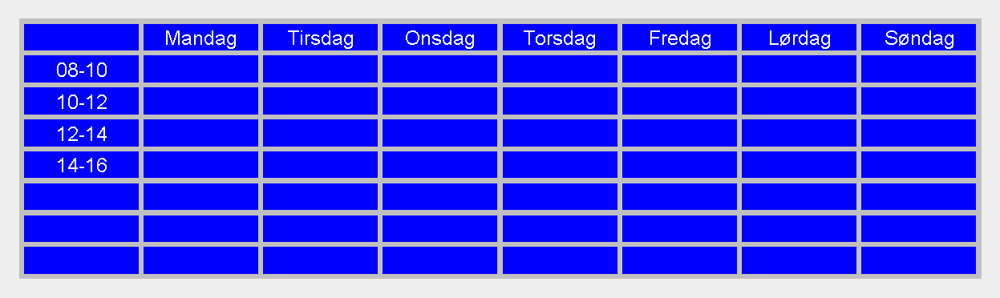

# Lab 6

## Læringsmål

- Bruke `generics`
- Kunne oversette ikke-generiske klasser til å bli generisk
- Bruke arv og abstrakte klasser for å fjerne duplikat kode

## Intro
Generics er et viktig verktøy i Java og noe vi allerede har brukt så langt, uten å vite det. Du har sikkert brukt ``List<>`` og ``ArrayList<>`` til å holde en gruppe objekter. Det som er praktisk med disse er at de kan holde på hva som helst! Nettopp fordi de er *generiske*. Du kan sette et hvilket som helst typenavn i ``<>`` og listen vil da kunne holde på den typen objekter.

I denne laben skal vi ta utgangspunkt i ``ColorGrid`` som ligner mye på `Grid` fra lab 5 og `TextGrid`. Dette gridet lagrer `Color`-objekter istedenfor `Character` som vi har jobbet med før.

Disse skal vi skrive om til å være generiske.
Dette vil gjøre at vi kan lage grids for andre formål også.

I TextGrid kan man i stedet for farger, fylle en boks med en tekstbit, for eksempel et ord. Da kan du lage en ukekalender som dette:

## Steg for steg

Det er litt mange oppgaver og ved første inntrykk kan det se litt mye ut, men det er ikke så mye du trenger å skrive på denne oppgaven. Når du forstår hva du skal gjøre er det fort gjort.

1. [TextGrid vs ColorGrid](./guide/01-textgrid_vs_colorgrid.md)
2. [GridCell](./guide/02-gridcell.md)
3. [GridCellCollection](./guide/03-gridcellcollection.md)
4. [IGrid](./guide/04-igrid.md)
5. [Grid](./guide/05-grid.md)
6. [Fjern duplikat kode i View](./guide/06-view-duplikat.md)
