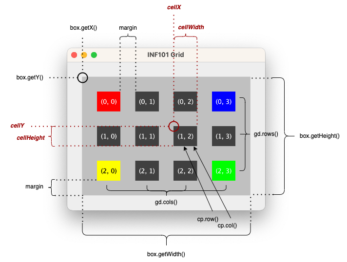

# **Implementering av `CellPositionToPixelConverter`**  

I steg 5 har vi behov for å lage **`CellPositionToPixelConverter`**, en hjelpeklasse som konverterer **gridposisjoner** (rad og kolonne) til **pikselkoordinater** i rutenettet.  

✅ **Målet er å beregne de nøyaktige pikselgrensene for hver celle, slik at de kan tegnes riktig i `GridView`.**  

---

## **1️⃣ Opprett `CellPositionToPixelConverter`-klassen**  

Lag en ny klasse **`CellPositionToPixelConverter`** i pakken **`no.uib.this OOP course.view`**.  
Denne klassen skal hjelpe med å konvertere **celleposisjoner** til **pikselkoordinater** innenfor en gitt **tegneflate (box)**.  

---

## **2️⃣ Definer nødvendige feltvariabler**  

For å beregne plasseringen av cellene trenger vi:  
- **`box`** – Et **Rectangle2D**-objekt som definerer området gridet skal tegnes innenfor.  
- **`gd`** – Et **GridDimension**-objekt som inneholder informasjon om **antall rader og kolonner**.  
- **`margin`** – En margin mellom cellene for å gi litt luft mellom dem.  

🔹 **Pseudokode:**  
```
Definer en Rectangle2D-variabel for tegneområdet
Definer en GridDimension-variabel for antall rader og kolonner
Definer en margin-verdi for spacing mellom cellene
```

---

## **3️⃣ Lag en konstruktør**  

Konstruktøren skal ta inn tre argumenter og lagre dem som instansvariabler:  
- **Et `Rectangle2D`-objekt** som definerer rutenettets tegneområde.  
- **Et `GridDimension`-objekt** for antall rader og kolonner i gridet.  
- **En `margin`**-verdi som brukes til spacing mellom cellene.  

🔹 **Pseudokode:**  
```
Metode CellPositionToPixelConverter(box, gd, margin):
    Lagre box som en instansvariabel
    Lagre gd som en instansvariabel
    Lagre margin som en instansvariabel
```

---

## **4️⃣ Implementer `getBoundsForCell`**  

Denne metoden skal:  
1. **Beregne bredden (`cellWidth`) og høyden (`cellHeight`) på en celle**  
   - Trekke fra marginene og dele på antall kolonner/rader.  
2. **Beregne startposisjonen (`cellX`, `cellY`) for cellen**  
   - Basert på kolonne/rad-indeks og margin.  
3. **Returnere et `Rectangle2D`-objekt** som representerer cellens plassering og størrelse.  

🔹 **Pseudokode:**  
```
Metode getBoundsForCell(pos):
    Beregn cellens bredde: (box.width - total margin) / antall kolonner
    Beregn cellens høyde: (box.height - total margin) / antall rader
    Beregn cellens X-posisjon basert på kolonnenummer
    Beregn cellens Y-posisjon basert på radenummer
    Returner et Rectangle2D-objekt med X, Y, bredde og høyde
```


---

## 🚀 **Neste steg:**  
Bruke `CellPositionToPixelConverter` i `GridView` for å plassere cellene riktig i tegneområdet! 🎉

🔙 [Tilbake til steg 2](./02-tegnrutenett.md)